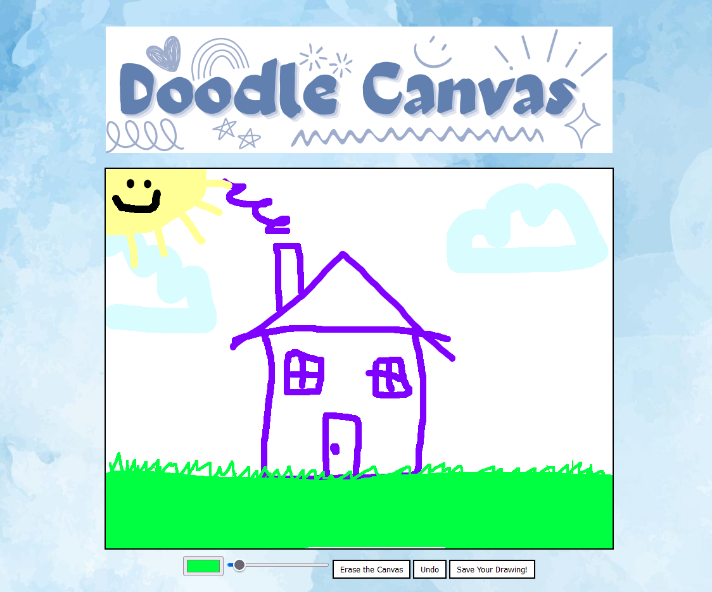
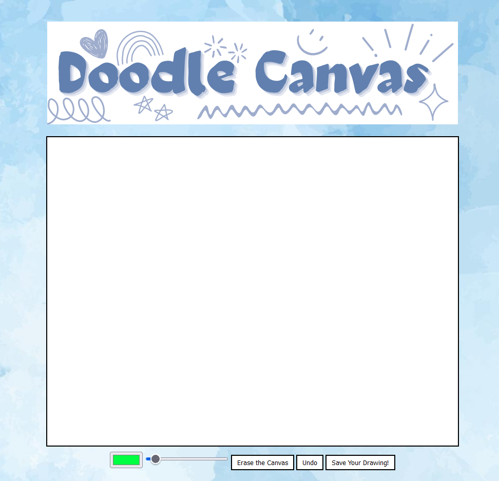

# Doodle Canvas
An interactive drawing app made with javascript, HTML and CSS. You can create and save your drawings.

## Description
-Users can select a color using the color picker

-Users can select a brush thickness with the slider

-Clicking and dragging in the blank canvas acts as a brush stroke, with the users preferred color and thickness settings

-If the user makes a mistake, they can click the "Undo" button to delete the previous brush stroke

-If the user wants to start over from scratch, they can select "Erase the Canvas" to clear all previous input

-After the user is satisfied with their drawing they can select the "Save Your Drawing!" button, which saves a file to desktop named 'mydrawing.png'

## Technologies Used
-HTML

-CSS

-Javascript

## How To Use

-Clone this repository

-Open the HTML file in your browser

# Enjoy Drawing!

## Javascript Concepts Used:

DOM Manipulation:

-  document.getElementById()
-  addEventListener

Canvas Drawing:

-  Using <canvas> element to create a drawing area.
-  getContext('2d') for 2D rendering for the canvas.
-  beginPath(), moveTo(), lineTo(), and stroke() to draw lines.
-  lineJoin and lineCap context properties for styling.

Variables:

-  let, declaring and initializing variables.

Arrays:

-  Using arrays to store drawing information.

Conditional Statements:

-  if statements.

Functions:

-  Defining functions to encapsulate and reuse code.
-  Parameters in functions.
-  Calling functions.

Event Handling:

-  Handling mouse events with mousedown, mousemove, mouseup, and mouseout.

Object Literal:

-  Using object literals to display lines with color, line width, and points.

Looping:

-  forEach loop to iterate through arrays.

Mathematical Operations:

-  function calculateDistance(x1, y1, x2, y2)
-  Hue values and line positions, based on mouse events.

Canvas Image Export:

-  canvas.toDataURL() to export canvas content.

Downloading Files:

-  Allowing users to save drawings by creating a link that downloads when clicked.

## New Concepts Learned:

-Drawing canvases
-Draw function
-Save content in images
-Color pickers
-Sliders
-Cursor-oriented event listeners
-Undo draw function
-Knowing to look for saving specific array properties (such as line color, width, starting/stopping points)